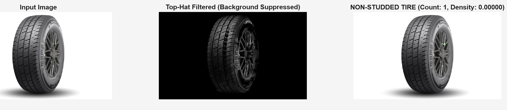
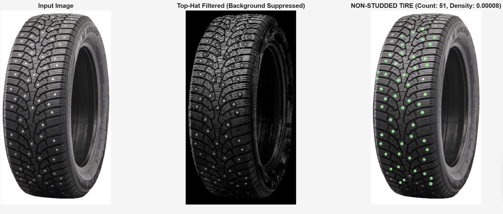

# Tire Stud Detector

A simple **MATLAB** script that detects **metal studs** on vehicle tires using image processing. It classifies tires as **STUDDED** or **NON-STUDDED** by analyzing bright spots (studs) on the dark tire surface.

Perfect for:
- Winter tire inspection
- Regulatory compliance checks (e.g., Finland's studded tire season: Nov 1 – Mar 31)
- Tire quality control or inventory systems

---

## Features

- Reads and processes multiple tire images
- Automatic tire segmentation using **Otsu's thresholding**
- **Adaptive bright-spot detection** (studs)
- Morphological cleaning and noise removal
- Shape-based filtering (area, circularity, eccentricity)
- Counts studs and classifies tire type
- Visual output with overlays

---

## Sample Output

### Non-Studded (Summer Tire)


> **NON-STUDDED TIRE (studs: 0)**  
> (Minor false positives from reflections)

---

### Studded (Winter Tire)


> **STUDDED TIRE (studs: 51)**  
> Accurate detection of visible metal studs

---

## Requirements

- **MATLAB** (R2020b or later recommended)
- **Image Processing Toolbox**

No external packages needed.

---

## Repository Contents

```
TireStudDetector/
├── tire_stud_detector.m      # Main script
├── studded_tire.jpg          # Sample studded tire
├── summer_tire.jpg           # Sample summer tire
├── README.md                 # This file
└── LICENSE                   # MIT License
```

---

## How to Use

1. **Clone the repo**
   ```bash
   git clone https://github.com/HammadKhalid75/Lab-9.git
   cd Lab-9
   ```

2. **Open MATLAB** and run:
   ```matlab
   tire_stud_detector
   ```

3. **View results** in pop-up figures.

---

### Add Your Own Images

Edit the `imageFiles` array in the script:
```matlab
imageFiles = {'my_tire1.jpg', 'my_tire2.jpg'};
```

> Tip: Use clean, well-lit side-view photos with white/light background.

---

## How It Works (Step-by-Step)

| Step | Method |
|------|--------|
| 1. Read & Resize | `imread`, `imresize(0.5)` |
| 2. Grayscale | `rgb2gray` |
| 3. Tire Mask | Otsu (`graythresh`) + `bwareaopen` + `imfill` + largest component |
| 4. Stud Candidates | Adaptive: `mean + 2.5×std` inside tire |
| 5. Clean | `bwareaopen`, `imfill` |
| 6. Analyze | `bwconncomp`, `regionprops` (Area, Perimeter, Eccentricity) |
| 7. Filter | Area: 4–120 px, Circularity ≥ 0.6, Eccentricity ≤ 0.85 |
| 8. Classify | `studCount > 30` → **STUDDED** |

---

## Parameters (Tune if needed)

| Parameter | Default | Purpose |
|---------|--------|--------|
| `minA` | 4 | Min stud area (px) |
| `maxA` | 120 | Max stud area |
| `minCirc` | 0.6 | Min circularity |
| `maxEcc` | 0.85 | Max eccentricity |
| Threshold | `mean + 2.5×std` | Brightness cutoff |
| Stud threshold | `>30` | For "STUDDED" label |

> Adjust for different image resolution or lighting.

---

## Example Use Case (Finland)

```matlab
% Check if tire is legal for current date
today = datetime('today');
studSeason = (month(today) >= 11 || month(today) <= 3) || ...
             (month(today) == 10 && day(today) >= 1) || ...
             (month(today) == 4 && day(today) <= 30);

if isStudded && ~studSeason
    disp('Warning: Studded tires not allowed outside Nov–Mar!');
end
```

---

## Contributing

1. Fork the repo
2. Create a feature branch
3. Commit changes
4. Push and open a Pull Request

Ideas:
- Add GUI with `uifigure`
- Support batch folders
- Export results to CSV
- Add deep learning fallback

---

